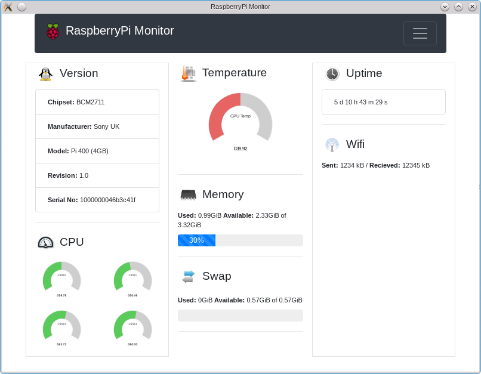

# RaspberryPi-Monitor

Currently under development, Raspberry Pi Monitor aims to be a full featured hardware monitor for any raspberry Pi you may be running it on with a Linux operating system installed. This includes graphs with precise information plotted in real time for your reference.

## CPU Load (%)

It shows a Guage style graph show the current load under each CPU core you may have on your Raspberry Pi in terms of percentage.

## CPU Temperature

A view of the current core temperature is always visible so you know when you may be coming close to its recommended limits.

## Memory Usage

Memory usage is displayed in a process chart showing the percentage your Raspberry Pi is currently implementing. A break down of what the memory may be being used for will be implemented in future releases.

## Supporting This Project

Making this suite of useful tools and references for the community can be time consumning and if you feel you are in a position to show thanks by means of buying me a coffee. Please feel free to support us. You can do so at https://www.patreon.com/SimonHodgson

Or if you would like to contribute to this project with your own time please feel free to contact me or if you have a specific feature in mind that you have taken the time to code yourselve send me a patch and it will be seriously considered for future release.

More to follow...
