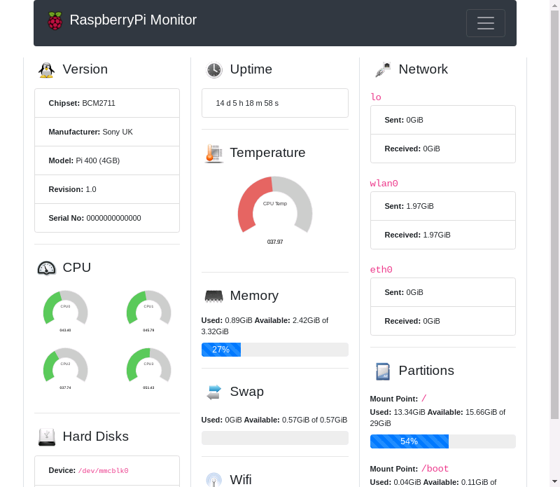
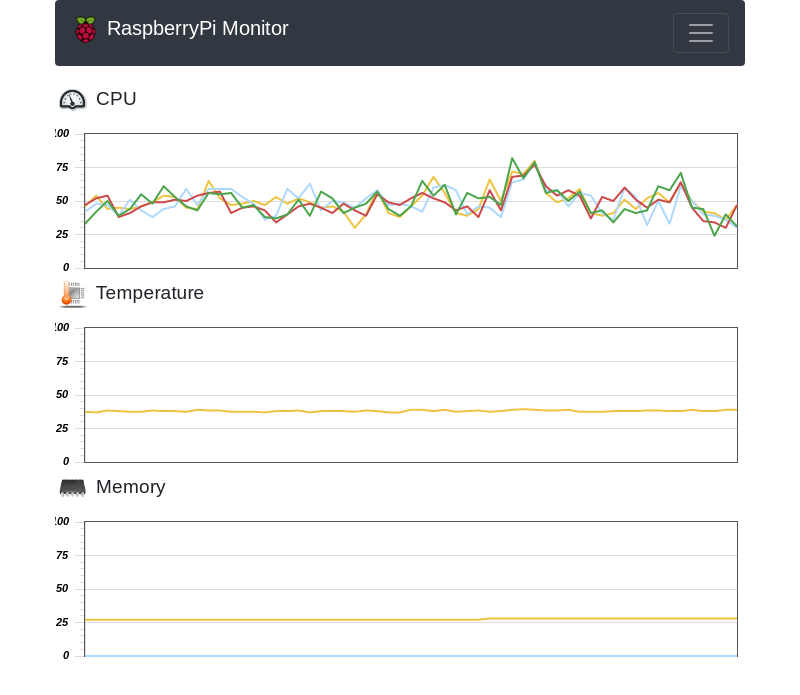

# RaspberryPi-Monitor

Coming towards it's first stable release, Raspberry Pi Monitor is a full featured, modular hardware monitor for any raspberry Pi you may be running it on with a Linux operating system installed. This includes graphs with precise information plotted in real time for your reference. At the moment it requires a Pi to be connected to a monitor so it cannot be controlled or used over the network or on headless systems. This may change in the future (not sure).

## CPU Load (%)

It shows a gauge style graph show the current load under each CPU core you may have on your Raspberry Pi in terms of percentage. It will also plot the CPU load statistics on a line graph which will auto update according to the settings which best suit your requirements.

## CPU Temperature

A view of the current core temperature is always visible so you know when you may be coming close to its recommended limits. Again plotted on a line graph so you have a histoical view of the temperature during specific operations.

## Memory Usage

Memory usage is displayed in a progress chart showing the percentage your Raspberry Pi is currently using. A break down of what the memory is being used will be visible along side the visual bar chart.

## Version Information

A list of interesting version information is able to be displayed so you can see which chipset, manufacturer, model and even the serial number of the Pi you are currently using.

## Uptime

A Count up timer of the current uptime the Pi has been running for is visually avialable, again updated at your prefered interval. Set to 1 minute by default.

## Hard Disk Information

A list of available hard disks is listed to make you aware of all block devices available to be written to by yourself.

## Partitions / Filesystems

Along with a list of partitions with the specific filesystem currently being implemented on all block devices available.

## Wifi Details

Current wifi SSID you are connected to is visible / available, again updated as frequently as you may like.

All these features are modular, so they can all be switched on or off individually and more addons / modules can be installed / created according to your requirements. Things like weather widgets or word of the day features could easily be developed, simply by creating a file which could the be inserted into the modules folder.

## Supporting This Project

Making this suite of useful tools and references for the community can be time consumning and if you feel you are in a position to show thanks by means of buying me a coffee. Please feel free to support us. You can do so at https://www.patreon.com/SimonHodgson

Or if you would like to contribute to this project with your own time please feel free to contact me or if you have a specific feature in mind that you have taken the time to code yourselve send me a patch and it will be seriously considered for future releases.
